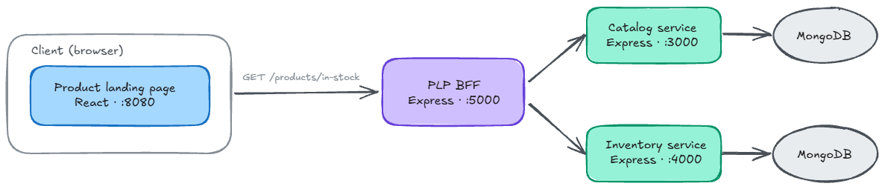
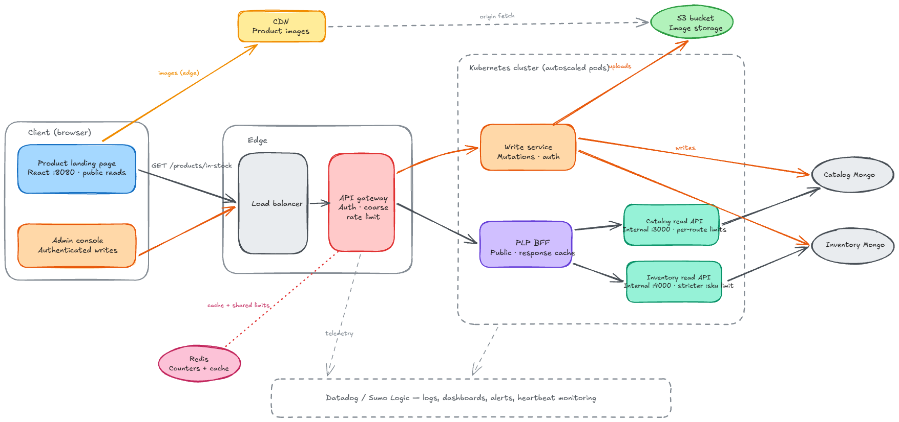

# Hi!

I kept a log alongside me as I developed this codebase. Below is a summary of the decisions I made along the way. You can see the progression of the app through my git commits.

Instead of overengineering from the get go, I thought I would solve the assessment tasks one by one and then look to improve it afterwards. However that didn't take me that long and so I thought I would flesh it out with some other features I add to my other services.

While a lot of our workflow at leap is done purely though orchestrating agents now (with varying results), I slowed down my pace here, hand wrote a lot of the initial sections/commits (not that it matters) and just kept it as a reference as I implemented the features I wanted to. 
Though, towards the end of the project I allowed the agent to refactor files more freely as I felt I'd already spent enough time on this project and wanted to finish up.

Doing it again, I would have refactored the plp earlier into a frontend/backend. I held off at the start because it didn't specify it in the task requirements but decided to towards the end because it was obviously necessary.

Lastly, for this project I decided not to focus on the front end. I'm quite comfortable with front end design but I made the assumption that that wasn't the focus of this project.

---

## Run the stack

For local development without Docker, run 
```bash
./dev-local.sh
```

With Docker
```bash
docker compose up --build
```

- PLP: http://localhost:8080
- Swagger UI (interactive API docs — open these in a browser once the stack is up):
  - BFF: http://localhost:5000/docs
  - Catalog: http://localhost:3000/docs
  - Inventory: http://localhost:4000/docs
- Postman: import `tests/postman/Universal Store APIs.postman_collection.json` (and optionally `tests/postman/local.postman_environment.json` for local base URLs)


## Architecture overview



| Service | Port | Responsibility |
|---------|------|----------------|
| Catalog | 3000 | Product metadata (sku, title, price, image) |
| Inventory | 4000 | Stock quantities by SKU |
| PLP BFF | 5000 | Aggregates catalog + inventory; exposes one PLP-facing endpoint |
| Product Landing Page | 8080 | Renders in-stock products |

This is a thin system for displaying catalog and inventory data. Catalog owns product metadata, inventory owns stock quantities, and a small BFF joins the two so the product landing page can show only what's in stock — without the frontend talking to either upstream service directly.

## Per-service documentation

| Service | README | OpenAPI |
|---------|--------|---------|
| Catalog | `services/catalog/README.md` | http://localhost:3000/docs |
| Inventory | `services/inventory/README.md` | http://localhost:4000/docs |
| PLP BFF | `services/plp-bff/README.md` | http://localhost:5000/docs |
| Integration tests | `tests/integration/README.md` | — |
| E2E tests | `tests/e2e/README.md` | — |
| Postman collection | `tests/postman/` | Import into Postman or run via Newman |


# Key Decisions
### Splitting plp-bff into a Backend for Frontend
This was the obvious decision to make to achieve loose coupling. Joining catalog and inventory in the browser wouldn't make sense as it pushes domain logic into the ui. Clients should be thin and data transformation should take place on the backend. Instead it makes much more sense for it to fetch from a single api and display that data. If it was left the way it was, it would tightly couple the frontend with the catalog and inventory which would also mean that the two apis couldn't evolve independently.

**To be explicit:**
- The PLP only needs **products in stock** — one endpoint, one response shape.
- The frontend should not know catalog and inventory URLs, CORS rules, or merge logic.
- Catalog and inventory remain internal services the browser never talks to.
- If upstream APIs change, only the BFF needs updating — not the React app.
- Separate MongoDB instances make a database join impossible anyway; HTTP aggregation is the correct approach.

### Test-driven development
Since this was mentioned in the criteria, I wanted to provide generous test coverage across the various services. I started with some simple Jest unit/integration tests as I fleshed out the APIs, starting with catalog. Same story for the PLP, though mainly through a unit test of the join function (my initial take on aggregating the two APIs). I'd like to be forgiven for that; I was in a bit of a rush the day I received the project.

Anyhow. Once the initial tasks were done, I added some simple Jest integration tests and Playwright e2e tests to mirror how we'd typically approach this in development. The integration tests are there to prove the HTTP contracts align. Nothing complicated. I kept a lot of things relatively simple to save time — if I had more time, more comprehensive coverage would probably be one of the first things I'd expand on.

I also set up a GitHub workflow to run the testing jobs. With more time, I'd split the unit tests from some of the heavier e2e tests onto separate jobs/branches.

Lastly, I added a Postman collection. I generated the endpoint tests because handwriting them all would have taken too long. Those are in the workflow as well. There's some overlap with the integration tests, but I kept them for demonstration purposes.

### Splitting express construction and process
A small design decision that was done so that the app could be injectable into tests. app.ts -> app.ts + server.ts

### Zod for runtime API validation
I was unfamiliar with this package but what I wanted was validation without manually writing typeguards and validating api responses.

### Using a store/atoms for shared frontend state
This one was slightly unnecessary given the small scope of the project but I implemented it for a couple reasons. A, familiarity, B, it's relatively simple, and C, since it was a landing page, it was done with the anticipation that it would grow across multiple components and they might share state. So not necessary but did it to avoid later hassle.

### Security hardening (ACSC Essential Eight)
Cybersecurity is always important so I wanted to include some work that reflected that. There's a couple frameworks out there. Our company has us use STRIDE and Essential 8. Many of their points are irrelevant however there were a few that were relevant, most notably around application hardening (plus two other minor ones).

The main things we added were input validations and rate limiting. This can be seen in the app.ts files for the sku look up. If we had post requests those would be validated too.

As for rate limiting, I just used express middleware. Nothing complicated. If I had more time there's a lot more that could be done here. It also depends on the design of the system in production. Are we putting all the services behind an api gateway? Do they have replicas and need a shared Redis state for user rate count (also depends on the gateway service which usually manages this).
There are other production concerns for rate limiting but I mention them in another place.

Another thing. As we don't have Commands and auth or privileges there wasn't too much to be concerned about here. If I had more time I would have implemented an admin panel in the frontend that would allow for creation of new items in the catalog and then implemented auth/authorisation, CQRS/CRUD in the services, but there just wasn't that much time and I didn't want to balloon my scope.

Other things that were done (really just modifying the base project); CORS restriction, adding patch applications in CI, removing mongodb ports from docker-compose (exposed, but this is a takehome project so not too critical).

### Swagger 
Not really much to write about here. For endpoint documentation swagger and openapi yaml.

### Error handling and logging
Some nice to have features. I kept them simple because I was short on time but did throw them in there just for demo purposes. If I had more time and this was a production system I would set up logging middleware for sumologic/datadog.

And for the error handling I would be much more comprehensive (structured logs, etc)

## If I had more time
- Login/user specific data (orders, lists)
  - JWT for client to BFF
  - API Key for the bff to talk to the services/api gateway
  - New services/db for users/orders
  - Full CRUD for those. Maybe even CRUD for new catalog items.
  - CQRS (Separate write/read services + events)
- Ability to add new products
- Frontend
  - Add storybook/design library to front end
  - Flesh out landing page
  - Multiple pages/routes for  things like product types (would need a separate entity for product types)
  - Component library would be decomposed into things like /layouts, /ui etc.
  - Feature folder for feature driven development

---
## Other thoughts on production and scaling

Ideas on how this would evolve beyond the take-home. Really just depends on what the requirements are.
1. **API gateway** in front of all services — single entry point, auth, primary rate limiting. Only the BFF is public; catalog and inventory stay internal.
2. **Separate write service** for mutations (stock adjustments, catalog updates). Read APIs stay optimised for query throughput.
3. **Load balancer + Kubernetes** (or ECS/Cloud Run) for elastic, horizontally scaled container workloads.
4. **Datadog / Sumo Logic** for centralised logging, dashboards, and alerts. Wire up the heartbeat stubs for uptime monitoring.
5. **Authentication & authorisation** — public PLP reads stay open; admin writes and service-to-service calls require API keys or OAuth.
6. **Per-route rate limits** on internal services for flexible policies (e.g. stricter limits on `GET /inventory/:sku` to prevent enumeration).
7. **Redis for rate-limit counters** across multiple container replicas — in-memory limiters only see their own pod. The gateway handles the coarse public cap; Redis is needed at the service level when replicas share a limit. BFF response caching is a separate win (short TTL on `/products/in-stock`).
8. **S3 + CDN** for product images — faster edge loading on the PLP; catalog stores CDN URLs, uploads go through the write service.

Maybe something like this (quick mockup)



### Production consideration
RateLimiting
- Rate limiting keys on client IP via req.ip. In production, a reverse proxy sits in front of the API, so Express must be configured with trust proxy to read the real client IP from X-Forwarded-For; otherwise all traffic appears to come from one address and per-client limits fail.
- Rate limits need a shared store (Redis) because the requests would be split across multiple containers behind a load balancer
This would ensure that the limit is enforced globally regardless of who runs the request
- Scope per api vs per api key: scoping by ip address is good for anonymous public apis, but might not be good for authenticated partners (such as a backend or a some other legitimate partner) and some other conditions (mobile carrier nat, corporate office with one ip)
In this case you would need an API key and you can rate limit by that identity
- If we separate the plp into BFF then we would have a separate route for traffic from it
- The primary rate limiter should be on the api gateway.
Heartbeat
- Added stubs, but would need for service monitoring
Logging
- implemented a basic logger but really would hook it up to a service like sumologic or datadog
Swagger
- protect or disable Swagger: it exposes your full API surface (routes, schemas, errors), which helps attackers. Common approaches are basic auth on /docs, only enabling it in non-prod, or keeping it on an internal network/VPN.
